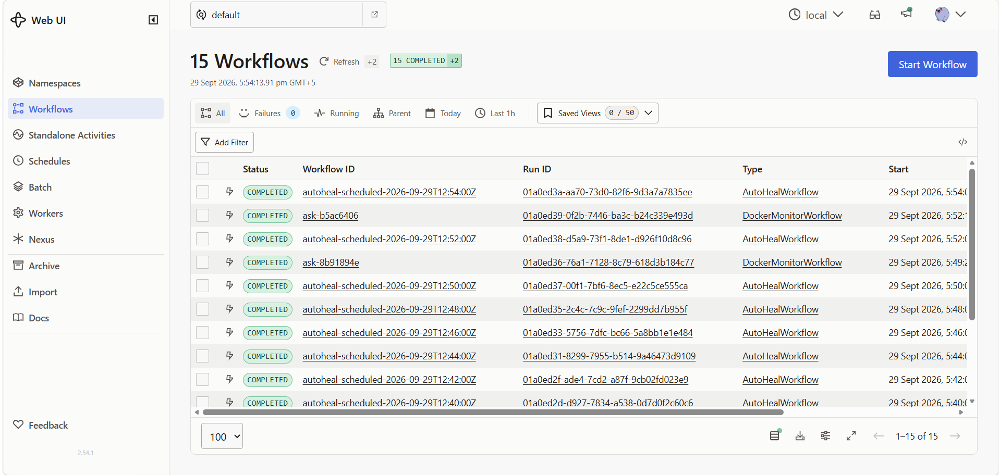
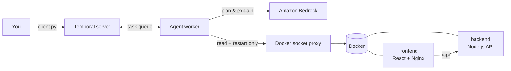

# Docker Health Agent

An AI agent that watches Docker containers, explains what is wrong from their logs and metrics, and restarts unhealthy containers. Every step runs as a [Temporal](https://temporal.io) workflow, so it is retried on failure and recorded in a full execution history.

Built with **Python, Strands Agents, Amazon Bedrock, Temporal and Docker**, plus a small React + Node.js app for the agent to monitor.



## What it does

- **Answers questions in plain English**: "is backend healthy?", "check frontend logs", "show container status".
- **Checks health** from Docker: status, healthcheck result, CPU %, memory % and restart count.
- **Explains problems**: the LLM reads the logs and suggests a likely cause and fix.
- **Auto-heals on a schedule**: restarts containers that are unhealthy but still running, the case Docker's own restart policy does not handle.
- **Knows when to stop**: a container in a crash loop is escalated to a human instead of being restarted again.
- **Keeps working without the AI**: if Bedrock is unavailable, health checks and healing still run, and answers are clearly marked as rule-based.

## Architecture



| Service | Role |
|---|---|
| `frontend` | React app served by Nginx, shows whether the backend is online |
| `backend` | Express API with `/health` and two demo endpoints to cause failures |
| `temporal` | Temporal dev server and Web UI |
| `worker` | The agent: Temporal workflows and activities, calls Bedrock and Docker |
| `docker-proxy` | Gives the agent read and restart access only, never the raw Docker socket |

## Quick start

**Prerequisites:** Docker with Compose v2, an AWS account with Bedrock access (see [docs/BEDROCK-SETUP.md](docs/BEDROCK-SETUP.md)), and AWS credentials in `~/.aws`.

```bash
git clone https://github.com/aliahmedd1201/docker-health-agent.git
cd docker-health-agent
cp .env.example .env            # set API_KEY, and your AWS profile/region if needed
docker compose up -d --build
docker compose ps               # all services should be Up
```

| URL | What |
|---|---|
| http://localhost:8081 | Demo app |
| http://localhost:8233 | Temporal Web UI |

No Bedrock access yet? Everything still starts. The agent falls back to keyword matching and says so in each answer.

## Usage

Ask the agent (each question is one Temporal workflow):

```bash
docker compose exec worker python client.py "show container status"
docker compose exec worker python client.py "is backend healthy?"
docker compose exec worker python client.py "check backend logs"
```

Run auto-heal once, or on a schedule:

```bash
docker compose exec worker python client.py heal
docker compose exec worker python client.py schedule 2    # every 2 minutes
```

Chat with the agent directly, without Temporal (the LLM picks the tools itself):

```bash
docker compose exec -it worker python agent.py
```

## Demo scenarios

**1. Crash: handled by Docker.** The backend exits and Docker's restart policy brings it back.

```bash
curl -X POST -H "x-api-key: <API_KEY>" localhost:8081/api/crash
docker inspect -f '{{.RestartCount}}' backend      # increases by 1
```

**2. Unhealthy: handled by the agent.** The backend keeps running but stops answering. Docker marks it unhealthy and does nothing else.

```bash
curl -X POST -H "x-api-key: <API_KEY>" -H "Content-Type: application/json" \
     -d '{"seconds":60}' localhost:8081/api/stress
sleep 50 && docker compose ps                       # backend (unhealthy)
docker compose exec worker python client.py heal    # agent explains and restarts it
```

**3. Crash loop: escalated.** Crash the backend 5 times, then run `heal`. The agent reports it as a crash loop and does not restart it again.

Every run appears in the Temporal UI with each activity, its input and output, and any retries.

## How AI failures are handled

| Situation | Behaviour |
|---|---|
| Temporary error (throttling, timeout) | Temporal retries with backoff (3 attempts). SDK-level retries are disabled so nothing retries silently. |
| Permanent error (no access, quota, missing setup) | Fails fast without retrying, then falls back. |
| AI unavailable during a question | Keyword-based plan; the answer says the AI was not used and why. |
| AI unavailable during auto-heal | Healing still runs, since the restart decision is rule-based. The report says the AI analysis was unavailable. |

## Configuration

Set in `.env` (see [.env.example](.env.example)):

| Variable | Default | Purpose |
|---|---|---|
| `API_KEY` | required | Protects the backend demo endpoints |
| `AWS_PROFILE` | `default` | Profile from `~/.aws` used by the worker |
| `AWS_REGION` | `us-east-1` | Bedrock region |
| `BEDROCK_MODEL_ID` | Claude Haiku 4.5 | Any Bedrock model you can access |
| `ALLOWED_CONTAINERS` | `backend,frontend` | The only containers the agent may restart |

## Project structure

```
├── docker-compose.yml     all services
├── app/
│   ├── backend/           Express API + Dockerfile (non-root, healthcheck)
│   └── frontend/          React + Nginx, multi-stage Dockerfile
├── agent/
│   ├── workflows.py       Temporal workflows: answer a question, auto-heal
│   ├── activities.py      Units of work: Docker calls and LLM calls
│   ├── llm.py             Bedrock access and error classification
│   ├── fallback.py        Rule-based planner used when the LLM is down
│   ├── docker_utils.py    Docker SDK wrapper and health rules
│   ├── worker.py          Temporal worker
│   ├── client.py          CLI: ask, heal, schedule
│   ├── agent.py           Interactive tool-calling agent
│   └── tests/             Unit tests
└── docs/
    ├── BEDROCK-SETUP.md   Credentials, model access, quotas, IAM policy
    └── DECISIONS.md       Design decisions and trade-offs
```

## Running the tests

```bash
cd agent
python3 -m venv .venv && source .venv/bin/activate
pip install -r requirements-dev.txt
pytest -q
```

## Troubleshooting

| Problem | Fix |
|---|---|
| `bind: address already in use` on 8081 | Change the left side of `8081:8080` in `docker-compose.yml` |
| Answers say `AI unavailable ... tokens per day` | Your Bedrock quota is zero or used up. See [docs/BEDROCK-SETUP.md](docs/BEDROCK-SETUP.md#quotas) |
| `use case details have not been submitted` | Submit the Anthropic use-case form, wait 15 minutes, or switch to an Amazon Nova model |
| `NoRegionError` | Set `AWS_REGION` in `.env` or `region` in your AWS profile |
| `Using the login credential provider requires ... botocore[crt]` | Already in `requirements.txt`; rebuild with `docker compose build worker` |
| Restart returns HTTP 403 | Your docker-socket-proxy version needs `POST: 1` in the `docker-proxy` service |
| Worker keeps restarting at startup | Temporal is still booting; it connects once the server is up |

## Limitations and next steps

- Temporal runs in dev mode (single container, in-memory history). Production would use Temporal Cloud or a full cluster.
- The agent watches one Docker host. Multiple hosts would need one worker per host or a Kubernetes-based design.
- Next: deploy on AWS (Terraform, EC2 in a private subnet, SSM Session Manager, Secrets Manager) with a CI/CD pipeline.

## Author

**Ali Ahmed**, DevOps Engineer · AWS Certified Solutions Architect – Associate
[LinkedIn](https://www.linkedin.com/in/ali-ahmed-928623167)

## License

[MIT](LICENSE)
